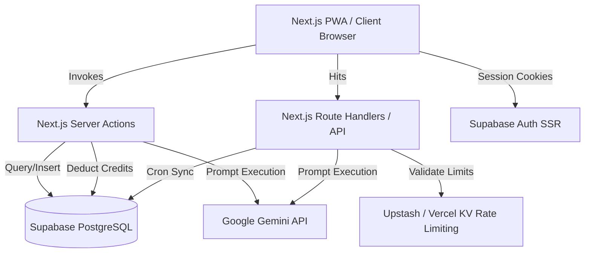

# ExamPilot Brain — Absolute Single Source of Truth

This document serves as the absolute single source of truth for ExamPilot. It outlines the architecture, data flows, database designs, APIs, security mechanisms, technical debt, and system boundaries for both human developers and AI coding agents.

---

## 1. Executive Summary & Architecture

### Project Purpose
ExamPilot is a production-grade, highly performant EdTech SaaS designed specifically for Indian defense exam aspirants preparing for **AFCAT, CDS, and NDA**. 
* **Key Goal:** Solve planning paralysis and habit-collapse through an AI-driven Study Planner that turns raw syllabi (uploaded as PDF or images) into personalized, day-by-day study schedules.
* **Secondary Goal:** Replicate the 1:1 Computer-Based Test (CBT) portal environment of official exams (e.g., C-DAC, EdCIL) through an offline-resilient, anti-cheat protected testing engine, paired with AI-driven tactical analysis of test attempts to address weaknesses.

### High-Level Architecture
ExamPilot is built using a modern serverless model combining the Next.js App Router (Vercel) with Supabase (PostgreSQL + Auth + Storage).



### Folder Responsibilities
* **`exampilot/src/app`**: Contains routing, pages, Next.js API route handlers, and Server Actions.
  * `(legal)`: Static document layouts (ToS, Privacy Policy, Cookies).
  * `actions/`: Encapsulates server-side transactions (Planner, Mock Attempts, Streak calculations, Booklets, News).
  * `api/`: Tejas chat (`/api/chat`), coach (AI Coach), and cron routes (`fetch-news`, `purge`, `streak-nudge`, and `generate-mocks` — the auto mock-question generator).
* **`exampilot/src/components`**: Core React components.
  * `TestRunner.tsx`: The primary CBT mock testing engine.
  * `MockTestAnalyzer.tsx`: Form for logging manual scores and visualizing accuracy trends.
  * `CreatePlanForm.tsx`: Form interface for syllabus uploading and plan generation.
  * `PlanViewer.tsx`: Interactive dashboard for viewing and updating study plans.
  * `NewsFeed.tsx`: Vertical snap-scrolling current affairs feed.
* **`exampilot/src/context`**: React context providers (e.g., `OnboardingContext`).
  * `OnboardingContext.tsx`: Tracks states for new user onboarding screens.
* **`exampilot/src/hooks`**: Custom React hooks.
  * `useAntiCheat.ts`: Registers tab visibility, right-click, and copy listeners during active exams.
  * `useNetworkStatus.ts`: Custom hook checking live connectivity status.
* **`exampilot/src/lib`**: Decoupled utilities governing business rules.
  * `creditManager.ts`: Handles credit deduction/refund via the `deduct_credits`/`refund_credits` RPCs (atomic, no read-check-write race) using the service role client. Admins are bypassed (never charged, never refunded).
  * `credits.ts`: Holds `BETA_STARTING_CREDITS` and shared credit constants (single source for the beta grant).
  * `aiRateLimit.ts`: Per-user sliding-window limiter (20 req/min) for the AI endpoints, layered on top of the credit meter. **Fails open when Vercel KV is not configured** (local dev), so absence of KV silently disables the cap.
  * `cronAuth.ts`: Shared bearer-token guard for cron route handlers (validates `CRON_SECRET`, constant-time compare, fails closed, Bearer-header only).
  * `mockGenerator.ts`: **Shared** full-mock question generation used by BOTH the admin "Generate Full Mock" button and the auto-generation cron. Centralizes prompt/batching/parsing and — critically — stamps every row `review_status: 'pending'` so manual and automated paths are identical and no AI question can reach a live test unreviewed. Exports `MOCK_SUBJECT_MAP`, `SUPPORTED_EXAMS`, `generateFullMockRows(examTarget)`.
  * `examConfig.ts`: Holds questions and marks configurations for exam targets.
  * `sanitizer.ts`: Filters emails and phone numbers from inputs before invoking LLMs.

  **AI Study Wingman — "Tejas":** The floating chat assistant (`FloatingAssistant.tsx`) is branded **Tejas** (after the indigenous fighter jet). Identity is enforced server-side in `/api/chat` via a white-label system prompt (never leaks the underlying provider). Uses Vercel AI SDK v7 — messages carry text in `parts[]` (NOT a `content` string); the client uses `sendMessage({ text })` and the server uses `convertToModelMessages(...)`. Logged-out visitors get a canned "create an account" reply streamed as a v7 UI-message stream; authenticated users hit the live metered Gemini path. `TejasSpotlight.tsx` on the guest landing page boasts the feature with a scripted demo and a "Talk to Tejas" CTA that opens the panel via a `tejas:open` custom event.
* **`exampilot/src/utils`**: Standard loaders (e.g., Supabase client and server declarations).
* **`exampilot/tests`**: Playwright E2E integration tests.
* **`exampilot/docs/legal`**: Raw markdown documents for legal pages.

### Technology Stack
* **Framework:** Next.js `14.2.35` (App Router, Node.js Serverless runtime)
* **Styling:** Tailwind CSS `3.4.1` (Strictly native utility classes; no component UI libraries like Shadcn/MUI)
* **Database & Auth:** Supabase PostgreSQL with `@supabase/ssr` `0.12.0` and `@supabase/supabase-js` `2.110.1`
* **AI Engine:** Google Gemini API via `@google/generative-ai` `0.24.1` and Vercel AI SDK (`ai` `7.0.26` / `@ai-sdk/google` `4.0.14`). **All endpoints use the `gemini-2.5-flash` model string** — the `gemini-1.5-flash` alias was retired by Google on 2025-09-24 and `gemini-3.1-flash-lite` was a hallucinated/non-existent id; using either surfaces to users as an "overloaded"/"AI service unavailable" error. When bumping the model, change every call site (chat, coach, planner, flashcards, cheatsheet, test-strategy, news-MCQs, admin-seed, cron fetch-news).
* **PWA Engine:** `@ducanh2912/next-pwa` `10.2.9` (Service worker handling caching/routing offline fallbacks)
* **State Management:** Zustand `5.0.14` (Managing active CBT test state)
* **Caching & Rate Limits:** `@upstash/ratelimit` `2.0.8` & `@vercel/kv` `3.0.0`
* **Testing:** Playwright `@playwright/test` `1.61.1`

### Dependency Graph
```
[Client UI] ──> [Zustand Store] ──> [LocalStorage (Offline Mirror)]
     │
     └──> [Next.js Server Actions] ──> [@supabase/ssr (User Auth Session)]
               │              │
               │              ├──> [creditManager] ──> [Supabase Service Client]
               │              │
               │              └──> [Google AI SDK] ──> [Gemini API]
               │
               └──> [Middleware] ──> [Upstash Redis / Vercel KV]
```

---

## 2. Core Execution & Data Flow

### Execution Flow
1. **Request Interception:** Next.js middleware intercepts requests via `src/middleware.ts` to refresh the Supabase session.
2. **Grace-Period Account Recovery check:** If a user's profile is flagged as `is_deleted` and the 48-hour deadline has not expired, they are redirected to `/settings/recover`. If the deadline has expired, they are signed out and redirected to `/login?account=permanently-deleted`.
3. **Legal Interstitial Guard:** Middleware checks for a `consent_granted` cookie. If missing, it checks the database profile. If the user has not accepted the current version of the Terms of Service, they are redirected to `/consent` before accessing any application routes.
4. **PWA Activation:** The browser registers the PWA service worker (`sw.js`). Cached assets (static assets and the CBT page shell) load instantly.

### Authentication (Login Page)
The `/login` page (`src/app/login/page.tsx`) uses a **two-step flow**: (1) enter email → (2) enter password, with Google OAuth and a "send a magic link instead" fallback available. Legal/age consent is shown inline as a disclosure ("By continuing, you agree to…"); the enforced consent gate remains the post-auth `/consent` interstitial (see Execution Flow #3), which records `legal_consent_version`/`legal_consent_timestamp`.
* **Password action (`signUpWithPassword` in `login/actions.ts`) is sign-in-first, sign-up-fallback:** it calls `signInWithPassword` first (returning users get a real session via the SSR cookie writer); only on `invalid_credentials` does it fall back to `signUp`. Supabase's "email already registered" obfuscation (a user object with an **empty `identities` array** and no session) is detected and surfaced as "Incorrect password". New-account creation returns `{ success: true, pending: true }` → the UI shows "verify your email"; a returning-user sign-in returns `{ success: true }` → the client does a **full-page navigation** (`window.location.assign`) to `next` (or `/`) so middleware re-reads the fresh session cookie. `signUp` alone can NOT log an existing user in, which is why the sign-in attempt must come first.
* **Password minimum length (8 chars) is enforced server-side** in the action (not just client-side), because the client check is bypassable. Keep the two thresholds in sync.

### Request Lifecycle
#### A. Study Plan Generation
```
[User Form Submit]
      │ (examName, examDate, syllabus PDF/Image)
      ▼
[planner.ts Server Action]
      │
      ├──> [sanitizePrompt] (Strips phone/emails)
      ├──> [checkRateLimit] (Max 5 plans/min per user via Vercel KV)
      ├──> [checkAndDeductCredits] (Deducts 1 credit via Supabase Service Client)
      ├──> [fileToInlinePart] (Converts syllabus file to Base64 Part)
      ▼
[Gemini 3.1 Flash Lite API] ──(Generates Study Plan JSON)
      │
      ▼
[robustJsonParse] (Strips markdown backticks & attempts trailing comma fixes)
      │
      ▼
[study_plans Table Insertion] (Saves as JSONB object)
      │
      ▼
[Redirect Client to /planner/[id]]
```

#### B. CBT Mock Test Session
1. **Mock Generation:** User initiates mock. `getMockTest` queries `question_bank` matching `exam_target`. It pulls a target of 25% PYQs and 75% standard questions, excluding the `correct_index` to prevent cheating. Questions are shuffled using the Fisher-Yates algorithm.
2. **Local Session Init:** `TestRunner` mounts, initializes a Zustand `useTestStore` instance, and writes a mirror of state to `localStorage` (keys: `mock_attempt_[id]`).
3. **Interactive Testing:** User answers questions. `useAntiCheat` listens for tab changes (`visibilitychange`), context menu triggers, or copy events. Strikes increment. If the user incurs 3 strikes, the test automatically submits.
4. **Background Sync:** A background loop runs every 60 seconds (when `navigator.onLine` is true) invoking the `saveMockProgress` Server Action to save answers, statuses, and time remaining. If database errors occur, exponential backoff (30 seconds) is applied.
5. **Submission & Grading:** Upon manual or automatic submission, `saveMockProgress` runs with status `completed`. The server initiates **Server-Side Grading**:
   * It fetches the question answers directly from the database using the bypass-enabled `getAdminClient()`.
   * It recalculates correct/incorrect marks using bounds defined in `EXAM_CONFIGS`.
   * It computes subject-wise scores and updates the database row.
   * Materialized view leaderboards are refreshed.
6. **Analytics Delivery:** The user is redirected to the Results dashboard. They can select their learning style and request an "AI Tactical Coach" summary. This action calls `/api/coach` (deducting 1 credit) to generate strengths, weaknesses, and a 3-step action plan using `gemini-2.5-flash`.

---

## 3. Data & API Layer

### Database Design (Supabase PostgreSQL)

```
┌─────────────────────────────────┐          ┌───────────────────────────────────┐
│          user_profiles          │          │             profiles              │
├─────────────────────────────────┤          ├───────────────────────────────────┤
│ id (UUID, PK)                   │          │ id (UUID, PK)                     │
│ credits (INT, default 500)      │          │ full_name (TEXT)                  │
│ tier (VARCHAR, default 'beta')  │          │ email (TEXT)                      │
│ is_deleted (BOOLEAN)            │          │ last_active_date (TIMESTAMPTZ)    │
│ deletion_deadline (TIMESTAMPTZ) │          │ current_streak (INT)              │
│ legal_consent_version (VARCHAR) │          └───────────────────────────────────┘
│ legal_consent_timestamp (TZ)    │
└─────────────────────────────────┘          ┌───────────────────────────────────┐
                                             │          admin_whitelist          │
┌─────────────────────────────────┐          ├───────────────────────────────────┤
│           study_plans           │          │ email (TEXT, PK)                  │
├─────────────────────────────────┤          └───────────────────────────────────┘
│ id (UUID, PK)                   │
│ user_id (UUID, FK -> auth.users)│          ┌───────────────────────────────────┐
│ created_at (TIMESTAMPTZ)        │          │            news_cache             │
│ exam_name (VARCHAR)             │          ├───────────────────────────────────┤
│ exam_date (DATE)                │          │ id (UUID, PK)                     │
│ syllabus_text (TEXT)            │          │ headline (TEXT)                   │
│ generated_plan (JSONB)          │          │ summary (TEXT)                    │
└─────────────────────────────────┘          │ category (TEXT)                   │
                                             │ exam_relevance_score (INT)        │
┌─────────────────────────────────┐          │ source_url (TEXT, UNIQUE)         │
│          mock_attempts          │          │ image_url (TEXT)                  │
├─────────────────────────────────┤          │ fetched_at (TIMESTAMPTZ)          │
│ id (UUID, PK)                   │          └───────────────────────────────────┘
│ user_id (UUID, FK -> auth.users)│
│ exam_target (VARCHAR)           │          ┌───────────────────────────────────┐
│ test_number (INT)               │          │           question_bank           │
│ status (VARCHAR)                │          ├───────────────────────────────────┤
│ score (NUMERIC)                 │          │ id (UUID, PK)                     │
│ time_remaining (INT)            │          │ question (TEXT)                   │
│ answers_state (JSONB)           │          │ options (JSONB / Array)           │
│ subject_stats (JSONB)           │          │ correct_index (INT) [CLS PROTECTED]
│ updated_at (TIMESTAMPTZ)        │          │ exam_target (VARCHAR)             │
└─────────────────────────────────┘          │ subject (VARCHAR)                 │
                                             │ is_pyq (BOOLEAN)                  │
                                             │ pyq_year (INT)                    │
                                             │ source_pool (VARCHAR)             │
                                             │ explanation (TEXT)                │
                                             └───────────────────────────────────┘
```

#### Row & Column Level Security Rules
* **`user_profiles` / `study_plans` / `mock_attempts` / `daily_flashcards`**: Enabled with RLS. Operations are restricted via policy to `auth.uid() = user_id` (or `id` for user profiles).
* **`question_bank` / `news_cache` / `app_config`**: Authenticated users have read-only access (`SELECT`). Write operations are blocked and must be handled using the `SUPABASE_SERVICE_ROLE_KEY` bypass client.
* **Column Level Security (CLS) on `question_bank`**: Standard `authenticated` and `anon` users are denied select access on `correct_index` to prevent extraction.
  ```sql
  REVOKE SELECT (correct_index) ON question_bank FROM authenticated;
  REVOKE SELECT (correct_index) ON question_bank FROM anon;
  ```
* **`admin_whitelist`**: Read access is restricted to verifying own email:
  ```sql
  USING (auth.jwt() ->> 'email' = email);
  ```

#### Leaderboards Materialized View & Functions
* **`mock_leaderboards`**: Computes rankings by partitioning mock scores by exam target:
  ```sql
  CREATE MATERIALIZED VIEW mock_leaderboards AS
  SELECT user_id, exam_target, test_number, score,
         RANK() OVER (PARTITION BY exam_target, test_number ORDER BY score DESC) as rank_position
  FROM mock_attempts WHERE status = 'completed';
  ```
* **Indexes:** Unique index on `(user_id, exam_target, test_number)` for concurrent refreshes; lookup index on `(exam_target, test_number, score)` for RPC lookups.
* **`get_instant_rank(exam_target, test_number, score)`**: RPC function calculating rankings and percentiles without exposing the materialized view.

### API Contracts
All route handlers require authentication and session checks.

#### Route Handlers
* **POST `/api/chat`**:
  * **Payload:** `{ messages: Array<{ role: string, content: string }> }`
  * **Response:** Text stream (`gemini-2.5-flash` wrapper) of conversational academic guidance.
* **POST `/api/coach`**:
  * **Payload:** `{ prompt: string }`
  * **Response:** Text stream describing test performance insights. Deducts 1 credit.
* **GET `/api/cron/fetch-news`**:
  * **Auth:** Header `Authorization: Bearer <CRON_SECRET>` ONLY (via `isAuthorizedCron` — the secret is never accepted via query string, so it cannot leak through logs/Referer).
  * **Behavior:** Queries GNews, runs Gemini summarization and relevance scoring, and inserts new articles into the database. News MCQs generated from these are inserted as `review_status='pending'`.
* **GET `/api/cron/purge`**:
  * **Auth:** Header `Authorization: Bearer <CRON_SECRET>`.
  * **Behavior:** Force-deletes accounts and profile records where the 48-hour deletion grace window has expired.
* **GET `/api/cron/generate-mocks`**:
  * **Auth:** Header `Authorization: Bearer <CRON_SECRET>` (via `isAuthorizedCron`; fails closed).
  * **Behavior:** Auto-tops-up the mock question bank on an every-2-days cadence. **Cost-controlled:** each run refills at most ONE exam — the neediest whose APPROVED mock pool is below `APPROVED_FLOOR` (120) — and skips any exam whose PENDING backlog is ≥ `MAX_PENDING_BACKLOG` (300). Generated questions are inserted as `review_status='pending'` (never live until an admin approves). Returns a per-exam `{approved, pending}` report.
* **POST `/api/coach`** and **POST `/api/chat`** are the AI (Gemini) endpoints — see the Tejas note in Folder Responsibilities for the chat contract (v7 `parts[]`, `convertToModelMessages`, guest vs authed paths).

#### Core Server Actions
* `generateStudyPlan(formData)`: Reads exam data and uploads. Runs Gemini planner. Deducts 1 credit.
* `saveMockProgress(payload)`: Saves active test states. Recalculates grades on completion.
* `getMockTest(examTarget, mini)`: Fetches questions (25% PYQs / 75% standard). Shuffles.
* `generateCheatSheet(planId)`: Generates high-yield study lists. Deducts 5 credits. Caches results.
* `generateFlashcards()`: Daily flashcard builder. Deducts 3 credits. Caches results.
* `generateTestStrategy(score, maxScore, incorrectSubjects, studentArchetype)`: Generates AI recommendations. Deducts 1 credit.

---

## 4. Logic, Configurations & Standards

### Key Algorithms & Business Logic
* **Study Plan Division:** Exam dates are parsed to compute the remaining days. A day-by-day plan is constructed:
  * Revision days are scheduled on every 7th day.
  * At least 2 full mock test days are placed in the final 10% of the timeline.
  * The final 3 days are reserved for lighter study loads.
* **IST Date Math for Streaks:** To prevent timezone boundary issues, activity timestamps are normalized to Indian Standard Time (IST, UTC+5:30) before day-difference comparisons.
  * Diff = 1 day: Streak increments.
  * Diff = 0 days: Streak remains the same.
  * Diff > 1 day: Streak resets to 1.
* **Anti-Cheat Logic:** Checks for active state switches. Triggers warnings at strikes 1 and 2, and submits the test automatically on strike 3.
* **CBT Score Recalculation:** Standard exam rules are verified server-side:
  * AFCAT / CDS: `+3` for correct answers, `-1` for incorrect answers.
  * Current Affairs / Mini-Tests: `+1` for correct answers, `-0.33` for incorrect answers.

> **[VERIFY] — Official 2026 marking & duration values (DO NOT GUESS).** The
> per-exam marking scheme, negative-marking, question count, and duration in
> `src/lib/examConfig.ts` (`EXAM_CONFIGS`) drive server-side grading, the CBT
> timer, and the leaderboard. They must be confirmed against the **official
> 2026 AFCAT / CDS / NDA notifications** before this app is relied on for
> exam-accurate scoring — do NOT edit them from memory or "recollection." The
> values currently in code, pending official confirmation, are:
>
> | Exam | Questions | Duration | +Correct | −Wrong |
> |---|---|---|---|---|
> | AFCAT | 100 | 7200s (120 min) | +3 | −1 |
> | CDS (per paper) | 120 | 7200s (120 min) | +3 | −1 |
> | NDA_MATH | 120 | 9000s (150 min) | +2.5 | −0.833 |
> | NDA_GAT | 150 | 9000s (150 min) | +4 | −1.33 |
>
> Each row above is a candidate value awaiting a human check against the source
> notification. If any official value differs, update `EXAM_CONFIGS` (the single
> source of truth — the timer, grader, and leaderboard all read from it) and
> remove the corresponding row from this [VERIFY] list. Leave the values as-is
> until verified rather than substituting a guess.
* **AI Question Review Gate:** `question_bank.review_status` gates whether a question is servable. `approved` → eligible for live mocks/tests; `pending` → visible only in the admin Review tab; `rejected` → deleted. **Every AI-generated question is stamped `pending`** (both admin "Seed"/"Full Mock" buttons via `adminSeedQuestions.ts`, news MCQs via `generateNewsMCQs.ts`, and the auto-cron via `mockGenerator.ts`). Human-authored questions (`addManualQuestion`) are `approved` immediately. The live-serving queries (`getMockTest` ×4, `getCurrentAffairsTest`) all filter `.eq("review_status", "approved")`, so unreviewed AI output can never reach a student. Existing rows were backfilled to `approved` by the migration, so the gate added zero disruption. This is the uniform human-in-the-loop control over all machine-generated content.
* **Automated Mock Top-Up (cost-controlled):** `/api/cron/generate-mocks` drip-feeds the bank instead of regenerating everything. Per run it tops up **only the single neediest exam** whose APPROVED mock pool is below `APPROVED_FLOOR` (120), skips any exam with a pending backlog ≥ `MAX_PENDING_BACKLOG` (300), and inserts into `pending` for admin review. This bounds Gemini spend to at most one full mock's generation per invocation. Shared generation logic lives in `src/lib/mockGenerator.ts` so the manual admin button and the cron produce identical output (same prompt, batching, and `pending` stamp).

### Configuration Files
* **`next.config.mjs`**: Custom caching rules for Supabase requests, Next.js image configurations, static files, and Content Security Policy (CSP) headers.
* **`playwright.config.ts`**: Runs testing projects across chromium, webkit, firefox, and Mobile Chrome (Pixel 5 with `slowMo: 100` simulation). Sets dev server commands to `npm run dev`.

### SEO & Canonical Domain
* **Production domain is `https://exampilot-delta.vercel.app`.** This is the canonical origin used by `metadataBase`, the `alternates.canonical` tag, Open Graph URLs (`layout.tsx`), and the generated `robots.txt` / `sitemap.xml`.
* **`src/app/robots.ts`**: emits `/robots.txt` — allows `/`, disallows `/admin/`, `/api/`, `/settings/`; points at the sitemap.
* **`src/app/sitemap.ts`**: emits `/sitemap.xml` for the public routes (`/`, `/login`, `/planner`, `/practice`, `/news`, `/booklets`).
* ⚠️ **Known domain inconsistency (pre-existing, not blocking):** transactional email code still references `exampilot.in` (`api/cron/streak-nudge/route.ts` `from:`, `components/Header.tsx` support mailto, `emails/StreakNudgeEmail.tsx`). Reconcile these with the Vercel domain when the custom domain is finalized.

### Environment Variables
```ini
# Supabase variables (public by design — protected by RLS)
NEXT_PUBLIC_SUPABASE_URL=<set in Vercel env>
NEXT_PUBLIC_SUPABASE_ANON_KEY=<set in Vercel env>
NEXT_PUBLIC_SUPABASE_PUBLISHABLE_KEY=<set in Vercel env>

# API keys and secrets — NEVER commit real values; source from Vercel/`.env.local`
GEMINI_API_KEY=<set in Vercel env>
GNEWS_API_KEY=<set in Vercel env>
CRON_SECRET=<set in Vercel env>
SUPABASE_SERVICE_ROLE_KEY=<set in Vercel env>
```

### Coding Standards
* **Server Components:** Default to Next.js Server Components. Client Components should only be used for interactive features (indicated by `"use client"`).
* **Pure Styling:** Rely strictly on native utility classes (Tailwind CSS) instead of third-party design frameworks.
* **Fail-Open Strategy:** If non-critical infrastructure fails (e.g., rate limits or KV connections), default to mock data instead of blocking users.
* **Validation:** Apply strict schemas (Zod) to validate payloads at system boundaries.

### Naming Conventions
* **Directories:** Lowercase or kebab-case. Route groups are grouped in parentheses, e.g., `(legal)`.
* **Components:** PascalCase (e.g., `TestRunner.tsx`).
* **Actions / Hooks:** camelCase (e.g., `getStreak.ts`, `useAntiCheat.ts`).
* **Route Handlers:** Always named `route.ts`.

---

## 5. Patterns, Resiliencies & Security

### Reusable Patterns
* **Optimistic UI + Background Sync:** Marking topics completed triggers immediate UI updates, with the actual updates synced to Supabase in the background.
* **Persona Protection:** System prompts instruct models not to reveal references to OpenAI, Google, Gemini, or being an LLM, stating: *"I am ExamPilot's proprietary assessment/study engine."*
* **Exponential Backoff:** If mock attempts fail to sync, retry limits block the sync loop for 30 seconds to prevent Edge function overloads.
* **Decoupled Architecture:** De-couples the client UI thread from network sync operations in `TestRunner.tsx` to prevent latency and input lag during tests.

### Error Handling
* **White-Label AI Protection:** API exceptions hide provider-specific trace details from the client, returning white-labeled error tags (e.g., `AI_SERVICE_UNAVAILABLE`).
* **Global Catch Blocks:** All Server Actions wrap database updates in try-catch blocks to prevent server crashes.

### Security Practices
* **Anti-Cheat:** Active event listeners block right-clicking, text copying, and tab switching.
* **Column-Level Security:** Prevents access to correct answers from the browser. Correct indexes are verified exclusively server-side.
* **Input Redaction:** Sanitizes emails and phone numbers from text fields before sending them to the Gemini API.
* **File Constraints:** Validates syllabus file sizes (<5MB) and restricts uploads to allowed mime types (PDF and images).

### Performance Considerations
* **UI Memoization:** `TestRunner.tsx` uses `useMemo` and `useCallback` to prevent render waterfalls during active tests.
* **Leaderboards:** Pre-calculates positions using PostgreSQL Materialized Views. Refreshes run concurrently via cron, avoiding heavy transactional queries.
* **Dual-State Middleware:** Reads the `consent_granted` cookie to skip slow database queries on middleware loads.

---

## 6. Integrations, Delivery & Maintenance

### External Integrations
* **Google Gemini API:** Powering study plan generation, flashcard creation, cheat sheet summaries, AI Coach analysis, Tejas chat, news-MCQ extraction, and automated mock-question generation. All calls use `gemini-2.5-flash`.
* **GNews API:** Country-targeted current affairs articles.
* **Upstash Redis / Vercel KV:** Rate-limiting database for auth protection and per-user AI rate limiting (`aiRateLimit.ts`).
* **`pdf-lib` (`1.17.x`):** Pure-JS PDF generation for server-side mock-test export (`exportMockPdf.ts`). Chosen over headless-browser/native approaches because it runs in the serverless runtime with no binary dependency, and keeps the answer key server-side.

### Testing Strategy
* **E2E Integration Testing:** Playwright tests authenticate users by writing a mock session cookie (`sb-vdcmwlkbcisnidtubmnb-auth-token`) to bypass auth flows during test runs.
* **Mobile UX Validation:** Checks mobile layout styling on mock devices (Pixel 5).
* **Account-deletion & backend-regression specs:** `tests/account-deletion.spec.ts` exercises the full deletion lifecycle against a real Supabase test user; `tests/backend-regression.spec.ts` verifies the `user_profiles` schema actually supports the deletion update (guards against `PGRST204` column-not-found). Both **self-skip** when Supabase env vars are absent. ⚠️ `account-deletion.spec.ts` sets `NODE_TLS_REJECT_UNAUTHORIZED='0'` at module scope for the test process — acceptable for local/CI test runs only.

### CI/CD Pipeline & Deployment
* **Hosting:** Vercel serverless environment.
* **CI Build Triggers:** Automatic production deployments trigger on pushes to the production branch. ⚠️ This doc historically said `main`, but the repo's default/production branch is **`master`** — confirm the Vercel "Production Branch" setting matches before relying on push-to-deploy.
* **Linter Passes:** Linters are bypassed during production builds (`eslint.ignoreDuringBuilds: true`).

### Common Commands
* Setup: `npm install`
* Run Local Server: `npm run dev`
* Build: `npm run build`
* Run Tests: `npx playwright test`

### Important Files
* `exampilot/src/middleware.ts`: Auth, consent, deletion, and recovery route guards.
* `exampilot/src/components/TestRunner.tsx`: CBT engine and test review layout.
* `exampilot/src/app/actions/planner.ts`: Planner system prompt and parser.
* `exampilot/src/app/actions/mockAttempts.ts`: Anti-cheat verification and score validator.

---

## 7. Status & Technical Debt

### ⚠️ Pending DB Migrations (CRITICAL — code depends on these)
Several `.sql` files in `exampilot/` define schema/functions the application code **already calls**. They are NOT auto-applied — they must be run manually in the Supabase SQL editor (there is no `supabase/migrations` link, no DB connection string in env, and the REST API cannot run DDL). If a migration is not applied, the dependent feature fails at runtime with a schema-cache error that surfaces to users as a generic failure:

| Migration file | Adds | Symptom if unapplied |
|---|---|---|
| `atomic_credit_deduction.sql` | `deduct_credits` / `refund_credits` RPCs | Signed-in AI calls return `SYSTEM_ERROR` (402) → chat shows "lost signal" |
| `server_authoritative_attempts.sql` | `mock_attempts.served_question_ids`, `started_at` | **Starting ANY mock test fails** with `PGRST204` → "Could not start the test" |
| `question_review_status.sql` | `question_bank.review_status` (default `'approved'`) + check constraint + serve/review indexes | Live test serving filters `review_status='approved'`; if the column is missing, **starting any test fails** (`PGRST` column-not-found). Backfills existing rows to `approved` so applying it is zero-disruption. |
| `rls_credit_privilege_lockdown.sql` | RLS revoking client writes to credits/tier | Client could self-grant credits |
| `account_deletion_migration.sql` | `user_profiles.is_deleted` / `deletion_deadline` columns; **REVOKEs** client UPDATE on those columns and **DROPs** the legacy "Users can update their own deletion flags" policy | Deletion flags could be tampered with client-side if the REVOKE/DROP is unapplied. **Re-run-safe:** uses `ADD COLUMN IF NOT EXISTS` + `DROP POLICY IF EXISTS`, so it is idempotent against environments where the columns/policy already exist. |

**Deletion lifecycle hardening (this session):** `account_deletion_migration.sql` was rewritten from a client-facing `CREATE POLICY` (which granted the authenticated role UPDATE on the deletion flags) to a service-role-only model: it now `DROP POLICY IF EXISTS`es the old grant and `REVOKE`s UPDATE on `is_deleted`/`deletion_deadline` from `authenticated` and `anon`. The lifecycle is driven exclusively through the service role in `deleteAccount.ts`/`recoverAccount.ts`. **Action required before deploy:** re-run this migration against every Supabase environment — it is idempotent, so re-running where the columns already exist is safe, but the `DROP POLICY`/`REVOKE` MUST execute to actually close the client write surface.

**Status (as of this session): all four migrations above have been applied to the live Supabase instance and verified** (credit RPCs return balances; `served_question_ids`/`started_at` present; `review_status` present with all 744 legacy rows backfilled to `approved`).

**Deployment rule:** any new `.sql` file added to the repo MUST be run against every Supabase environment before the code that depends on it ships. Verify with: `select proname from pg_proc where proname in (...)` for functions, or a probe insert for columns.

### Known Limitations
1. **Schema Mismatch:** Streaks and user metadata are split across `profiles` and `user_profiles` tables, which increases database request complexity. The Settings page reads `full_name`/`avatar_url` from `user_profiles` where they may not live — verify against the live schema before relying on it.
2. **SSR Router Crash:** `/planner` has a known SSR crash under mock auth due to `usePathname` in the Sidebar firing server-side. Playwright E2E tests bypass this route because of this issue.
3. **Flashcards UI:** The dashboard flashcards feature is currently marked as "Coming Soon", although the backend logic is implemented.
4. **Cron-slot constraint (unresolved):** The app now has FOUR cron needs — `fetch-news`, `purge`, `streak-nudge`, and the new `generate-mocks` — but Vercel Hobby allows only 2 cron jobs at once-daily granularity. There is no `vercel.json`, so the existing crons are triggered by an external scheduler hitting the bearer-authed endpoints. **Recommended fix (not yet built):** a single `/api/cron/dispatch` endpoint invoked once daily that fans out by date logic (daily → news + streak-nudge; `dayOfYear % 2 === 0` → generate-mocks; weekly → purge). Collapses 4 schedules into 1 free slot, no new dependency. The individual endpoints remain for manual triggering.

### Assumptions & Unknowns
* **Leaderboard Cron Frequency:** Calculated via pg_cron, but the exact refresh frequency is "Unknown" (managed at the database level).
* **Autoscaling Connection Pool:** Exact PostgreSQL connection pool limits on Supabase are "Unknown".

### Maintenance Guidelines
* **Adding a New Exam:** Add target to `ExamTarget` in `examConfig.ts`, update `EXAM_CONFIGS` mapping with total questions and subject breakdowns, and verify the subject counts match the questions seeded.
* **Changing Prompts:** If altering Gemini system prompts, ensure the output response matches the strict JSON formatting instructions. Verify `robustJsonParse` fallbacks are correct.
