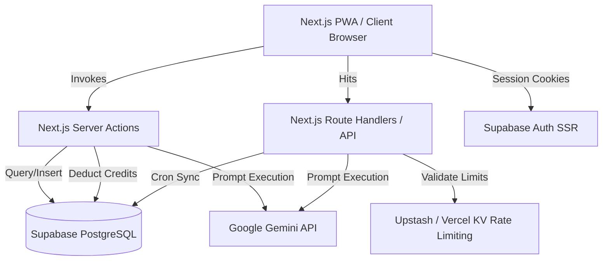

# ExamPilot Brain — Absolute Single Source of Truth

This document serves as the absolute single source of truth for ExamPilot. It outlines the architecture, data flows, database designs, APIs, security mechanisms, technical debt, and system boundaries for both human developers and AI coding agents.

---

## 1. Executive Summary & Architecture

### Project Purpose
ExamPilot is a production-grade, highly performant EdTech SaaS designed specifically for Indian defense exam aspirants preparing for **AFCAT, CDS, and NDA**. 
* **Key Goal:** Solve planning paralysis and habit-collapse through an AI-driven Study Planner that turns raw syllabi (uploaded as PDF or images) into personalized, day-by-day study schedules.
* **Secondary Goal:** Replicate the 1:1 Computer-Based Test (CBT) portal environment of official exams (e.g., C-DAC, EdCIL) through an offline-resilient, anti-cheat protected testing engine, paired with AI-driven tactical analysis of test attempts to address weaknesses.

### High-Level Architecture
ExamPilot is built using a modern serverless model combining the Next.js App Router (Vercel) with Supabase (PostgreSQL + Auth + Storage).



### Folder Responsibilities
* **`exampilot/src/app`**: Contains routing, pages, Next.js API route handlers, and Server Actions.
  * `(legal)`: Static document layouts (ToS, Privacy Policy, Cookies).
  * `actions/`: Encapsulates server-side transactions (Planner, Mock Attempts, Streak calculations, Booklets, News).
  * `api/`: Chat (AI Assistant), coach (AI Coach), and cron (News fetching and deleted users purging).
* **`exampilot/src/components`**: Core React components.
  * `TestRunner.tsx`: The primary CBT mock testing engine.
  * `MockTestAnalyzer.tsx`: Form for logging manual scores and visualizing accuracy trends.
  * `CreatePlanForm.tsx`: Form interface for syllabus uploading and plan generation.
  * `PlanViewer.tsx`: Interactive dashboard for viewing and updating study plans.
  * `NewsFeed.tsx`: Vertical snap-scrolling current affairs feed.
* **`exampilot/src/context`**: React context providers (e.g., `OnboardingContext`).
  * `OnboardingContext.tsx`: Tracks states for new user onboarding screens.
* **`exampilot/src/hooks`**: Custom React hooks.
  * `useAntiCheat.ts`: Registers tab visibility, right-click, and copy listeners during active exams.
  * `useNetworkStatus.ts`: Custom hook checking live connectivity status.
* **`exampilot/src/lib`**: Decoupled utilities governing business rules.
  * `creditManager.ts`: Handles database credit deduction using the service role client.
  * `examConfig.ts`: Holds questions and marks configurations for exam targets.
  * `sanitizer.ts`: Filters emails and phone numbers from inputs before invoking LLMs.
* **`exampilot/src/utils`**: Standard loaders (e.g., Supabase client and server declarations).
* **`exampilot/tests`**: Playwright E2E integration tests.
* **`exampilot/docs/legal`**: Raw markdown documents for legal pages.

### Technology Stack
* **Framework:** Next.js `14.2.35` (App Router, Node.js Serverless runtime)
* **Styling:** Tailwind CSS `3.4.1` (Strictly native utility classes; no component UI libraries like Shadcn/MUI)
* **Database & Auth:** Supabase PostgreSQL with `@supabase/ssr` `0.12.0` and `@supabase/supabase-js` `2.110.1`
* **AI Engine:** Google Gemini API via `@google/generative-ai` `0.24.1` (calling `gemini-3.1-flash-lite` and `gemini-1.5-flash`) and Vercel AI SDK (`ai` `7.0.26` / `@ai-sdk/google` `4.0.14`)
* **PWA Engine:** `@ducanh2912/next-pwa` `10.2.9` (Service worker handling caching/routing offline fallbacks)
* **State Management:** Zustand `5.0.14` (Managing active CBT test state)
* **Caching & Rate Limits:** `@upstash/ratelimit` `2.0.8` & `@vercel/kv` `3.0.0`
* **Testing:** Playwright `@playwright/test` `1.61.1`

### Dependency Graph
```
[Client UI] ──> [Zustand Store] ──> [LocalStorage (Offline Mirror)]
     │
     └──> [Next.js Server Actions] ──> [@supabase/ssr (User Auth Session)]
               │              │
               │              ├──> [creditManager] ──> [Supabase Service Client]
               │              │
               │              └──> [Google AI SDK] ──> [Gemini API]
               │
               └──> [Middleware] ──> [Upstash Redis / Vercel KV]
```

---

## 2. Core Execution & Data Flow

### Execution Flow
1. **Request Interception:** Next.js middleware intercepts requests via `src/middleware.ts` to refresh the Supabase session.
2. **Grace-Period Account Recovery check:** If a user's profile is flagged as `is_deleted` and the 48-hour deadline has not expired, they are redirected to `/settings/recover`. If the deadline has expired, they are signed out and redirected to `/login?account=permanently-deleted`.
3. **Legal Interstitial Guard:** Middleware checks for a `consent_granted` cookie. If missing, it checks the database profile. If the user has not accepted the current version of the Terms of Service, they are redirected to `/consent` before accessing any application routes.
4. **PWA Activation:** The browser registers the PWA service worker (`sw.js`). Cached assets (static assets and the CBT page shell) load instantly.

### Request Lifecycle
#### A. Study Plan Generation
```
[User Form Submit]
      │ (examName, examDate, syllabus PDF/Image)
      ▼
[planner.ts Server Action]
      │
      ├──> [sanitizePrompt] (Strips phone/emails)
      ├──> [checkRateLimit] (Max 5 plans/min per user via Vercel KV)
      ├──> [checkAndDeductCredits] (Deducts 1 credit via Supabase Service Client)
      ├──> [fileToInlinePart] (Converts syllabus file to Base64 Part)
      ▼
[Gemini 3.1 Flash Lite API] ──(Generates Study Plan JSON)
      │
      ▼
[robustJsonParse] (Strips markdown backticks & attempts trailing comma fixes)
      │
      ▼
[study_plans Table Insertion] (Saves as JSONB object)
      │
      ▼
[Redirect Client to /planner/[id]]
```

#### B. CBT Mock Test Session
1. **Mock Generation:** User initiates mock. `getMockTest` queries `question_bank` matching `exam_target`. It pulls a target of 25% PYQs and 75% standard questions, excluding the `correct_index` to prevent cheating. Questions are shuffled using the Fisher-Yates algorithm.
2. **Local Session Init:** `TestRunner` mounts, initializes a Zustand `useTestStore` instance, and writes a mirror of state to `localStorage` (keys: `mock_attempt_[id]`).
3. **Interactive Testing:** User answers questions. `useAntiCheat` listens for tab changes (`visibilitychange`), context menu triggers, or copy events. Strikes increment. If the user incurs 3 strikes, the test automatically submits.
4. **Background Sync:** A background loop runs every 60 seconds (when `navigator.onLine` is true) invoking the `saveMockProgress` Server Action to save answers, statuses, and time remaining. If database errors occur, exponential backoff (30 seconds) is applied.
5. **Submission & Grading:** Upon manual or automatic submission, `saveMockProgress` runs with status `completed`. The server initiates **Server-Side Grading**:
   * It fetches the question answers directly from the database using the bypass-enabled `getAdminClient()`.
   * It recalculates correct/incorrect marks using bounds defined in `EXAM_CONFIGS`.
   * It computes subject-wise scores and updates the database row.
   * Materialized view leaderboards are refreshed.
6. **Analytics Delivery:** The user is redirected to the Results dashboard. They can select their learning style and request an "AI Tactical Coach" summary. This action calls `/api/coach` (deducting 1 credit) to generate strengths, weaknesses, and a 3-step action plan using `gemini-3.1-flash-lite`.

---

## 3. Data & API Layer

### Database Design (Supabase PostgreSQL)

```
┌─────────────────────────────────┐          ┌───────────────────────────────────┐
│          user_profiles          │          │             profiles              │
├─────────────────────────────────┤          ├───────────────────────────────────┤
│ id (UUID, PK)                   │          │ id (UUID, PK)                     │
│ credits (INT, default 500)      │          │ full_name (TEXT)                  │
│ tier (VARCHAR, default 'beta')  │          │ email (TEXT)                      │
│ is_deleted (BOOLEAN)            │          │ last_active_date (TIMESTAMPTZ)    │
│ deletion_deadline (TIMESTAMPTZ) │          │ current_streak (INT)              │
│ legal_consent_version (VARCHAR) │          └───────────────────────────────────┘
│ legal_consent_timestamp (TZ)    │
└─────────────────────────────────┘          ┌───────────────────────────────────┐
                                             │          admin_whitelist          │
┌─────────────────────────────────┐          ├───────────────────────────────────┤
│           study_plans           │          │ email (TEXT, PK)                  │
├─────────────────────────────────┤          └───────────────────────────────────┘
│ id (UUID, PK)                   │
│ user_id (UUID, FK -> auth.users)│          ┌───────────────────────────────────┐
│ created_at (TIMESTAMPTZ)        │          │            news_cache             │
│ exam_name (VARCHAR)             │          ├───────────────────────────────────┤
│ exam_date (DATE)                │          │ id (UUID, PK)                     │
│ syllabus_text (TEXT)            │          │ headline (TEXT)                   │
│ generated_plan (JSONB)          │          │ summary (TEXT)                    │
└─────────────────────────────────┘          │ category (TEXT)                   │
                                             │ exam_relevance_score (INT)        │
┌─────────────────────────────────┐          │ source_url (TEXT, UNIQUE)         │
│          mock_attempts          │          │ image_url (TEXT)                  │
├─────────────────────────────────┤          │ fetched_at (TIMESTAMPTZ)          │
│ id (UUID, PK)                   │          └───────────────────────────────────┘
│ user_id (UUID, FK -> auth.users)│
│ exam_target (VARCHAR)           │          ┌───────────────────────────────────┐
│ test_number (INT)               │          │           question_bank           │
│ status (VARCHAR)                │          ├───────────────────────────────────┤
│ score (NUMERIC)                 │          │ id (UUID, PK)                     │
│ time_remaining (INT)            │          │ question (TEXT)                   │
│ answers_state (JSONB)           │          │ options (JSONB / Array)           │
│ subject_stats (JSONB)           │          │ correct_index (INT) [CLS PROTECTED]
│ updated_at (TIMESTAMPTZ)        │          │ exam_target (VARCHAR)             │
└─────────────────────────────────┘          │ subject (VARCHAR)                 │
                                             │ is_pyq (BOOLEAN)                  │
                                             │ pyq_year (INT)                    │
                                             │ source_pool (VARCHAR)             │
                                             │ explanation (TEXT)                │
                                             └───────────────────────────────────┘
```

#### Row & Column Level Security Rules
* **`user_profiles` / `study_plans` / `mock_attempts` / `daily_flashcards`**: Enabled with RLS. Operations are restricted via policy to `auth.uid() = user_id` (or `id` for user profiles).
* **`question_bank` / `news_cache` / `app_config`**: Authenticated users have read-only access (`SELECT`). Write operations are blocked and must be handled using the `SUPABASE_SERVICE_ROLE_KEY` bypass client.
* **Column Level Security (CLS) on `question_bank`**: Standard `authenticated` and `anon` users are denied select access on `correct_index` to prevent extraction.
  ```sql
  REVOKE SELECT (correct_index) ON question_bank FROM authenticated;
  REVOKE SELECT (correct_index) ON question_bank FROM anon;
  ```
* **`admin_whitelist`**: Read access is restricted to verifying own email:
  ```sql
  USING (auth.jwt() ->> 'email' = email);
  ```

#### Leaderboards Materialized View & Functions
* **`mock_leaderboards`**: Computes rankings by partitioning mock scores by exam target:
  ```sql
  CREATE MATERIALIZED VIEW mock_leaderboards AS
  SELECT user_id, exam_target, test_number, score,
         RANK() OVER (PARTITION BY exam_target, test_number ORDER BY score DESC) as rank_position
  FROM mock_attempts WHERE status = 'completed';
  ```
* **Indexes:** Unique index on `(user_id, exam_target, test_number)` for concurrent refreshes; lookup index on `(exam_target, test_number, score)` for RPC lookups.
* **`get_instant_rank(exam_target, test_number, score)`**: RPC function calculating rankings and percentiles without exposing the materialized view.

### API Contracts
All route handlers require authentication and session checks.

#### Route Handlers
* **POST `/api/chat`**:
  * **Payload:** `{ messages: Array<{ role: string, content: string }> }`
  * **Response:** Text stream (`gemini-3.1-flash-lite` wrapper) of conversational academic guidance.
* **POST `/api/coach`**:
  * **Payload:** `{ prompt: string }`
  * **Response:** Text stream describing test performance insights. Deducts 1 credit.
* **GET `/api/cron/fetch-news`**:
  * **Auth:** Header `Authorization: Bearer <CRON_SECRET>` or parameter `?secret=<CRON_SECRET>`.
  * **Behavior:** Queries GNews, runs Gemini summarization and relevance scoring, and inserts new articles into the database.
* **GET `/api/cron/purge`**:
  * **Auth:** Header `Authorization: Bearer <CRON_SECRET>`.
  * **Behavior:** Force-deletes accounts and profile records where the 48-hour deletion grace window has expired.

#### Core Server Actions
* `generateStudyPlan(formData)`: Reads exam data and uploads. Runs Gemini planner. Deducts 1 credit.
* `saveMockProgress(payload)`: Saves active test states. Recalculates grades on completion.
* `getMockTest(examTarget, mini)`: Fetches questions (25% PYQs / 75% standard). Shuffles.
* `generateCheatSheet(planId)`: Generates high-yield study lists. Deducts 5 credits. Caches results.
* `generateFlashcards()`: Daily flashcard builder. Deducts 3 credits. Caches results.
* `generateTestStrategy(score, maxScore, incorrectSubjects, studentArchetype)`: Generates AI recommendations. Deducts 1 credit.

---

## 4. Logic, Configurations & Standards

### Key Algorithms & Business Logic
* **Study Plan Division:** Exam dates are parsed to compute the remaining days. A day-by-day plan is constructed:
  * Revision days are scheduled on every 7th day.
  * At least 2 full mock test days are placed in the final 10% of the timeline.
  * The final 3 days are reserved for lighter study loads.
* **IST Date Math for Streaks:** To prevent timezone boundary issues, activity timestamps are normalized to Indian Standard Time (IST, UTC+5:30) before day-difference comparisons.
  * Diff = 1 day: Streak increments.
  * Diff = 0 days: Streak remains the same.
  * Diff > 1 day: Streak resets to 1.
* **Anti-Cheat Logic:** Checks for active state switches. Triggers warnings at strikes 1 and 2, and submits the test automatically on strike 3.
* **CBT Score Recalculation:** Standard exam rules are verified server-side:
  * AFCAT / CDS: `+3` for correct answers, `-1` for incorrect answers.
  * Current Affairs / Mini-Tests: `+1` for correct answers, `-0.33` for incorrect answers.

### Configuration Files
* **`next.config.mjs`**: Custom caching rules for Supabase requests, Next.js image configurations, static files, and Content Security Policy (CSP) headers.
* **`playwright.config.ts`**: Runs testing projects across chromium, webkit, firefox, and Mobile Chrome (Pixel 5 with `slowMo: 100` simulation). Sets dev server commands to `npm run dev`.

### Environment Variables
```ini
# Supabase variables (public by design — protected by RLS)
NEXT_PUBLIC_SUPABASE_URL=<set in Vercel env>
NEXT_PUBLIC_SUPABASE_ANON_KEY=<set in Vercel env>
NEXT_PUBLIC_SUPABASE_PUBLISHABLE_KEY=<set in Vercel env>

# API keys and secrets — NEVER commit real values; source from Vercel/`.env.local`
GEMINI_API_KEY=<set in Vercel env>
GNEWS_API_KEY=<set in Vercel env>
CRON_SECRET=<set in Vercel env>
SUPABASE_SERVICE_ROLE_KEY=<set in Vercel env>
```

### Coding Standards
* **Server Components:** Default to Next.js Server Components. Client Components should only be used for interactive features (indicated by `"use client"`).
* **Pure Styling:** Rely strictly on native utility classes (Tailwind CSS) instead of third-party design frameworks.
* **Fail-Open Strategy:** If non-critical infrastructure fails (e.g., rate limits or KV connections), default to mock data instead of blocking users.
* **Validation:** Apply strict schemas (Zod) to validate payloads at system boundaries.

### Naming Conventions
* **Directories:** Lowercase or kebab-case. Route groups are grouped in parentheses, e.g., `(legal)`.
* **Components:** PascalCase (e.g., `TestRunner.tsx`).
* **Actions / Hooks:** camelCase (e.g., `getStreak.ts`, `useAntiCheat.ts`).
* **Route Handlers:** Always named `route.ts`.

---

## 5. Patterns, Resiliencies & Security

### Reusable Patterns
* **Optimistic UI + Background Sync:** Marking topics completed triggers immediate UI updates, with the actual updates synced to Supabase in the background.
* **Persona Protection:** System prompts instruct models not to reveal references to OpenAI, Google, Gemini, or being an LLM, stating: *"I am ExamPilot's proprietary assessment/study engine."*
* **Exponential Backoff:** If mock attempts fail to sync, retry limits block the sync loop for 30 seconds to prevent Edge function overloads.
* **Decoupled Architecture:** De-couples the client UI thread from network sync operations in `TestRunner.tsx` to prevent latency and input lag during tests.

### Error Handling
* **White-Label AI Protection:** API exceptions hide provider-specific trace details from the client, returning white-labeled error tags (e.g., `AI_SERVICE_UNAVAILABLE`).
* **Global Catch Blocks:** All Server Actions wrap database updates in try-catch blocks to prevent server crashes.

### Security Practices
* **Anti-Cheat:** Active event listeners block right-clicking, text copying, and tab switching.
* **Column-Level Security:** Prevents access to correct answers from the browser. Correct indexes are verified exclusively server-side.
* **Input Redaction:** Sanitizes emails and phone numbers from text fields before sending them to the Gemini API.
* **File Constraints:** Validates syllabus file sizes (<5MB) and restricts uploads to allowed mime types (PDF and images).

### Performance Considerations
* **UI Memoization:** `TestRunner.tsx` uses `useMemo` and `useCallback` to prevent render waterfalls during active tests.
* **Leaderboards:** Pre-calculates positions using PostgreSQL Materialized Views. Refreshes run concurrently via cron, avoiding heavy transactional queries.
* **Dual-State Middleware:** Reads the `consent_granted` cookie to skip slow database queries on middleware loads.

---

## 6. Integrations, Delivery & Maintenance

### External Integrations
* **Google Gemini API:** Powering study plan generation, flashcard creation, cheat sheet summaries, and AI Coach analysis.
* **GNews API:** Country-targeted current affairs articles.
* **Upstash Redis:** Rate-limiting database for auth protection.

### Testing Strategy
* **E2E Integration Testing:** Playwright tests authenticate users by writing a mock session cookie (`sb-vdcmwlkbcisnidtubmnb-auth-token`) to bypass auth flows during test runs.
* **Mobile UX Validation:** Checks mobile layout styling on mock devices (Pixel 5).

### CI/CD Pipeline & Deployment
* **Hosting:** Vercel serverless environment.
* **CI Build Triggers:** Automatic production deployments trigger on pushes to the `main` branch.
* **Linter Passes:** Linters are bypassed during production builds (`eslint.ignoreDuringBuilds: true`).

### Common Commands
* Setup: `npm install`
* Run Local Server: `npm run dev`
* Build: `npm run build`
* Run Tests: `npx playwright test`

### Important Files
* `exampilot/src/middleware.ts`: Auth, consent, deletion, and recovery route guards.
* `exampilot/src/components/TestRunner.tsx`: CBT engine and test review layout.
* `exampilot/src/app/actions/planner.ts`: Planner system prompt and parser.
* `exampilot/src/app/actions/mockAttempts.ts`: Anti-cheat verification and score validator.

---

## 7. Status & Technical Debt

### Known Limitations
1. **Schema Mismatch:** Streaks and user metadata are split across `profiles` and `user_profiles` tables, which increases database request complexity.
2. **SSR Router Crash:** `/planner` has a known SSR crash under mock auth due to `usePathname` in the Sidebar firing server-side. Playwright E2E tests bypass this route because of this issue.
3. **Incomplete Configurations:** `NDA_MATH` and `NDA_GAT` are defined in `ExamTarget` types, but missing in `EXAM_CONFIGS`.
4. **Flashcards UI:** The dashboard flashcards feature is currently marked as "Coming Soon", although the backend logic is implemented.

### Assumptions & Unknowns
* **Leaderboard Cron Frequency:** Calculated via pg_cron, but the exact refresh frequency is "Unknown" (managed at the database level).
* **Autoscaling Connection Pool:** Exact PostgreSQL connection pool limits on Supabase are "Unknown".

### Maintenance Guidelines
* **Adding a New Exam:** Add target to `ExamTarget` in `examConfig.ts`, update `EXAM_CONFIGS` mapping with total questions and subject breakdowns, and verify the subject counts match the questions seeded.
* **Changing Prompts:** If altering Gemini system prompts, ensure the output response matches the strict JSON formatting instructions. Verify `robustJsonParse` fallbacks are correct.
